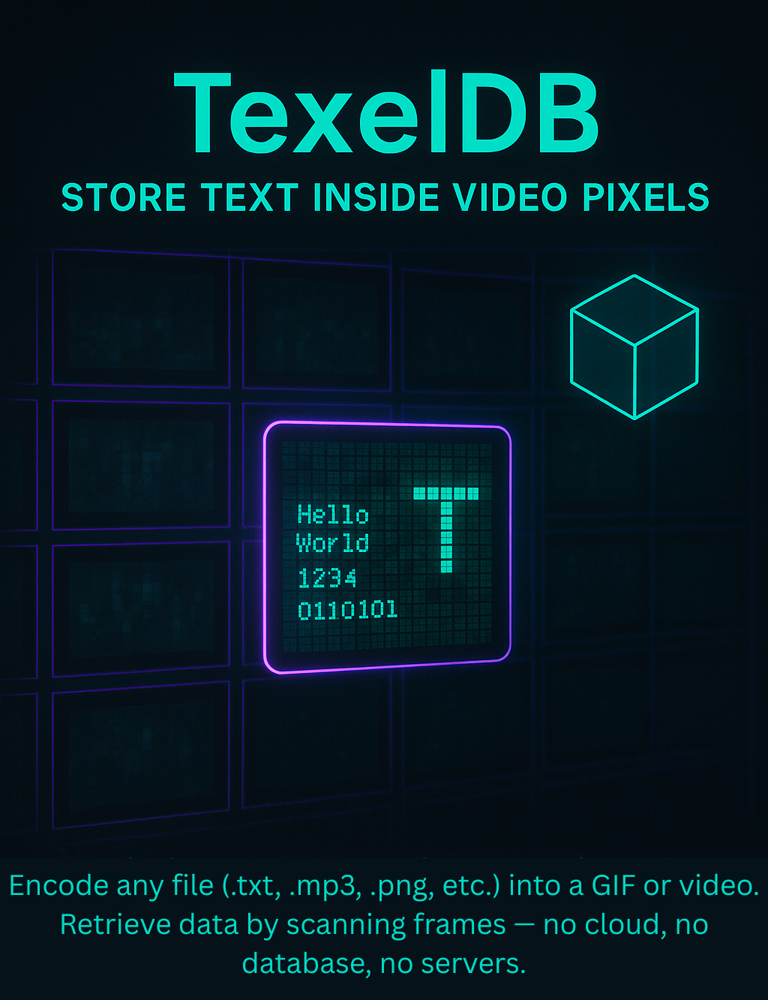

# 🎠 Data-to-Video Encoding System

<p style="display: flex; align-items: center; gap: 20px;">
  
  
</p>

## Installation and About Project : see [Installation and About Project](about-and-installation.md) md file

## Idea

What if users could encode any file as a **video**?

This project enables encoding arbitrary files into a sequence of high-resolution images (currently `.png`), which are then compiled into a `.gif` video. Since a 4K video at 60fps can store a large amount of data, this approach offers an innovative way to **back up and share data visually**.

Currently, only `.gif` output is supported. However, with better encoding and video formats, this system could potentially rival traditional storage mechanisms for specific use-cases.

---

## Example: Encoding an MP3 File

Suppose we want to encode the `test.mp3` audio file from the `backend/data` directory.

We call the `encode()` function with the path to the `.mp3` file:

```python
encode("data/test.mp3")
```

### What happens:

1. The file is read as raw binary.
2. Each bit is converted to either a black pixel `(0, 0, 0)` for `0` or a white pixel `(255, 255, 255)` for `1`.
3. These pixels are laid out on a 4K image (3840×2160).
4. Multiple `.png` frames are generated and stored in the `/temp` directory.
5. These frames are compiled into a final `.gif` file.

**Generated Output**: `test.mp3.gif`


This example consists of 1 4K `.png` image at 10 frames per second.

To increase the data bitrate, either:

* Increase the `.png` resolution.
* Increase the frame rate.

> Note: A small header is added to the binary before pixel conversion. See `Encoding & Decoding Process` below for details.

To recover the original file:

```python
decode("test.mp3.gif")
```

This will:

* Split the `.gif` back into its `.png` frames.
* Reverse the pixel encoding process.
* Reconstruct the original file and save it as `test.mp3-recovered`.

---

## ⚙️ Encoding & Decoding Process

### Step 1: Input & Headers

The system takes an arbitrary file (e.g., `data/test.txt`) and reads it as raw binary.

Then, three headers are prepended:


1. **Filename Length (16 bits)**:

   * Indicates how many bits are used in the next section (the filename).
   * Max: 65,535 bits → 8,192 characters.

2. **Filename**:

   * The actual name of the file in binary.
   * Variable-length, defined by the previous section.

3. **Payload Length (64 bits)**:

   * Specifies the size of the payload in bits.
   * Max file size: 2^64-1 bits.

4. **Payload**:

   * The raw binary content of the input file.

---

### Step 2: Binary to Pixels

* Each bit is converted:

  * `0` → black pixel `(0, 0, 0)`
  * `1` → white pixel `(255, 255, 255)`
* The result is a list of pixels.

These pixels are placed on a `.png` image of size 3840×2160 (4K):

* Total: 8,294,400 bits/frame ≈ 1 MB per frame.

---

### Step 3: Compile Frames into GIF

* Once the binary has been split into frames, `.png` images are saved.
* These images are compiled into a `.gif` at a specified frame rate.

---

### Decoding

To decode:

1. Split `.gif` into frames.
2. Convert each pixel back to a bit (`0` or `1`).
3. Read the headers:

   * First 16 bits → filename length
   * Next `n` bits → filename
   * Next 64 bits → payload length
   * Remaining bits → file content
4. Reconstruct the original file.

The recovered file is saved as `original_filename-recovered`.


