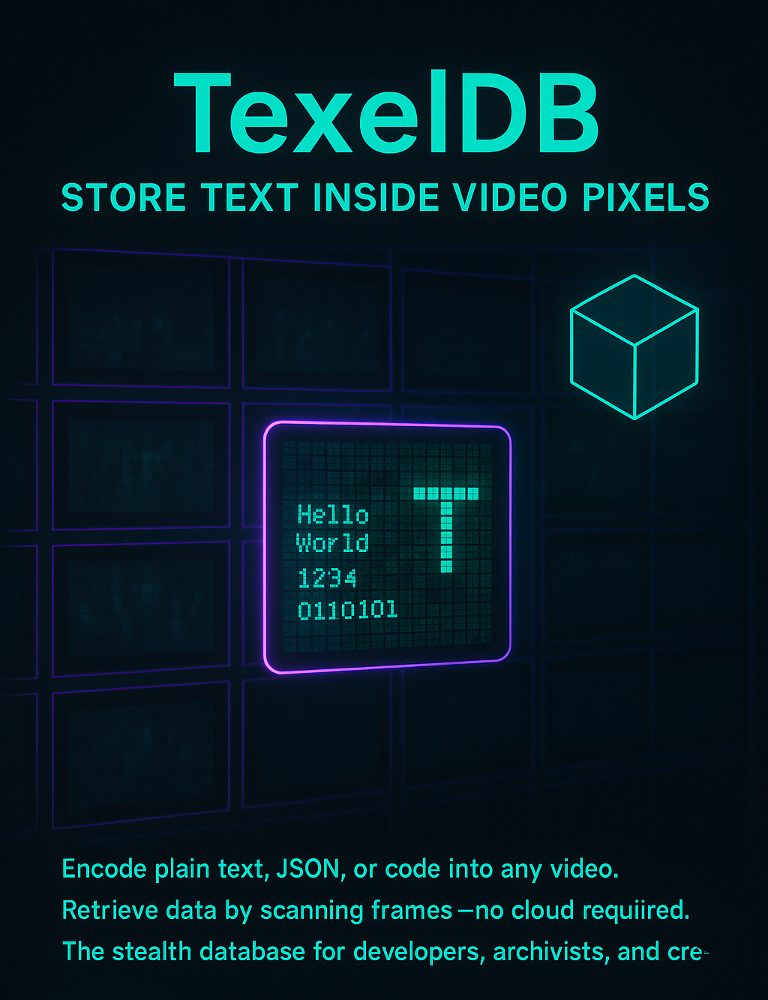

# TexelDB  

## Overview
TexelDB converts any file to a GIF image and back, implementing the "Text to Pixel" concept where data is stored as pixels in images.

<p style="display: flex; align-items: center; gap: 20px;">
  
  
</p>


## Architecture
- **Frontend**: React with Next.js, Tailwind CSS, and shadcn/ui components
- **Backend**: FastAPI with Python 3.11
- **Core Algorithm**: Binary data to pixel conversion (0=black, 1=white)

## Features Implemented

✅ **Encoding Process**
- Convert any file to binary data
- Add filename and size headers
- Convert bits to pixels (0=black, 1=white)
- Arrange pixels in 4K resolution frames
- Combine frames into GIF animation

✅ **Decoding Process**
- Split GIF into individual frames
- Convert pixels back to bits
- Decode headers to get filename and size
- Reconstruct original file perfectly

✅ **Error Handling**
- Comprehensive error messages
- Loading states and progress indicators

✅ **API Endpoints**
- POST /encode/ - Convert file to GIF
- POST /decode/ - Convert GIF back to file
- CORS enabled for frontend integration

## Technical Implementation

### Backend (FastAPI)
- Python 3.11 compatible
- Uses Pillow, imageio, and bitstring libraries
- Temporary file handling with proper cleanup
- Streaming responses for file downloads

### Frontend (React)
- Modern React with hooks
- Tailwind CSS for styling
- shadcn/ui components for professional UI
- File upload with drag-and-drop support
- Responsive design for all devices

## File Structure
```
texeldb/
├── backend/
│   ├── main.py              # FastAPI application
│   ├── texeldb.py           # Core encoding/decoding logic
│   └── requirements.txt     # Python dependencies
└── frontend/
    ├── src/
    │   ├── App.jsx          # Main React component
    │   ├── App.css          # Tailwind CSS styles
    │   └── components/ui/   # shadcn/ui components
    ├── index.html           # HTML entry point
    └── package.json         # Node.js dependencies
```

## How to Run

### Backend
```bash
cd backend
pip install -r requirements.txt # pip install -r requirements.txt --break-system-packages

python main.py
```
Server runs on http://localhost:8000

### Frontend
```bash
cd frontend
npm install
npm run dev
```
Application runs on http://localhost:5173

## Usage
1. Open the web application
2. Upload any file using the file picker
3. Click "Encode File" to convert to GIF
4. Download the generated GIF
5. Upload a TexelDB GIF to decode back to original file

## Technical Details
- Maximum file size per frame: ~1MB (4K resolution)
- Encoding format: 4K (3840x2160) pixels per frame
- Header format: 16-bit filename length + filename + 64-bit payload length
- Compression: Lossless (no data loss during conversion)

